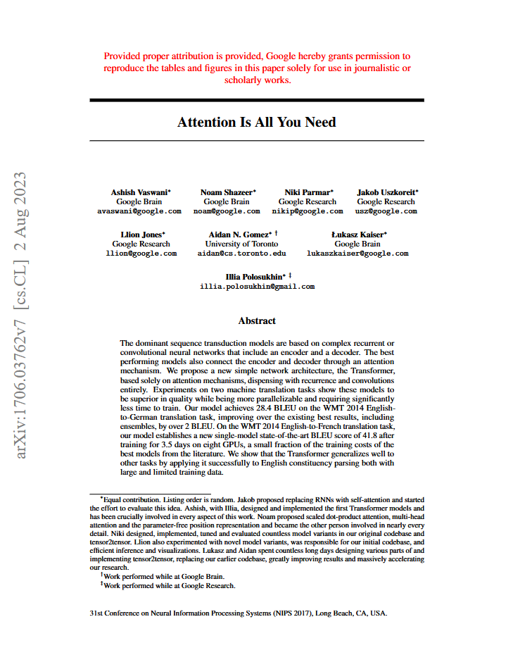
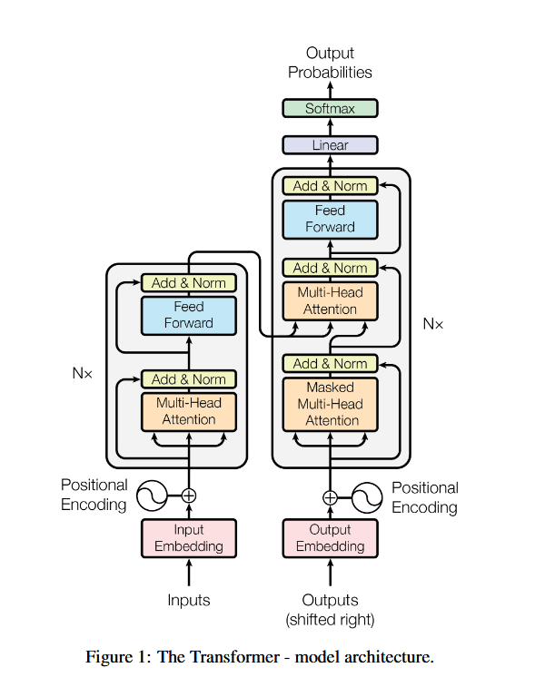
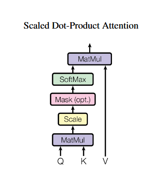
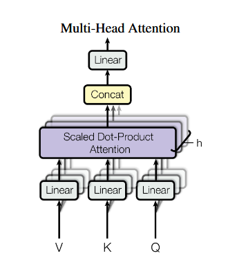

# Attention Is All You Need - German to English Translation
- This repository contains an implementation of a Transformer model for German-to-English translation, inspired by the seminal paper ["Attention Is All You Need"](https://arxiv.org/abs/1706.03762). The model is built using TensorFlow and Keras and follows the original architecture proposed in the paper.
<a href=https://arxiv.org/pdf/1706.03762v7>
  <p align="center">
    
  </p>
</a>

## Features
- Implements a full Transformer model from scratch
- Trains on the German-English dataset
- Uses self-attention mechanisms for efficient sequence modeling
- Supports positional encoding, multi-head attention, and layer normalization

## Requirements
```bash
pip install tensorflow numpy pandas
```

## Dataset
This model uses the German-English ["DataSet"](https://www.kaggle.com/datasets/shashanknecrothapa/english-to-german).

## Model Architecture

### Transformer Model
The model is built using TensorFlow and Keras, following the original architecture proposed in the paper. It consists of an encoder-decoder structure with attention mechanisms at its core.

<p align="center">
    
</p>

### Positional Encoding
Since the Transformer model does not use recurrence or convolution, positional encoding is added to the input embeddings to inject information about the position of words in a sequence.

### The Attention Mechanism
The Transformer relies heavily on attention mechanisms to capture relationships between words. The implementation of the Attention mechanism involves the following three steps:

#### 1. Causal Masking
Causal masking ensures that the model does not attend to future tokens during training, maintaining the autoregressive nature of the decoder.

#### 2. Scaled Dot-Product Attention
This step computes attention scores based on the dot-product similarity of query, key, and value vectors, scaled by the square root of the key dimension.
<p align="center">
    
</p>

#### 3. Multi-Head Attention
Multi-head attention allows the model to focus on different parts of the sequence simultaneously, improving the capture of complex dependencies.
<p align="center">
    
</p>

### The Encoder
The encoder consists of multiple layers, each containing:
- Multi-head self-attention
- Feed-forward neural networks
- Layer normalization and dropout

### The Decoder
The decoder follows a similar structure to the encoder but includes additional masked self-attention layers and cross-attention layers to attend to the encoder's output.

## Training
To train the Transformer model, run:

```bash
python transformer/transformer_de_to_en.py
```
## Results
After training, the model achieves competitive translation performance. Sample translations:

| German | English (Predicted) |
|--------|--------------------|
| "Guten Morgen!" | "Good morning!" |
| "Wie geht es dir?" | "How are you?" |
| "Ich liebe maschinelles Lernen." | "I love machine learning." |

## References
- Vaswani et al., *Attention Is All You Need*, 2017 ([Paper](https://arxiv.org/abs/1706.03762))
- TensorFlow documentation on Transformer models

## License
This project is licensed under the MIT License.

## Author
[kozue](https://github.com/kozuedoingregression)

